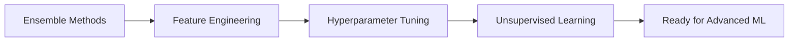

# 🎯 PHASE 2: Intermediate Machine Learning

**Show modeling depth and practical decision-making.**

Welcome to Phase 2! This phase demonstrates advanced machine learning concepts through four comprehensive projects that showcase ensemble methods, feature engineering mastery, optimization techniques, and unsupervised learning.

## 🏗️ Phase 2 Architecture

```
PHASE_02/
├── README.md                          # This overview
├── requirements.txt                   # Phase-wide dependencies
├── ensemble_learning/                 # Project 5: Random Forest & XGBoost
│   ├── loan_default_prediction.py
│   ├── README.md
│   ├── requirements.txt
│   └── outputs/
├── feature_engineering_masterclass/   # Project 6: Sales Forecasting
│   ├── sales_forecasting.py
│   ├── README.md
│   ├── requirements.txt
│   └── outputs/
├── hyperparameter_tuning/             # Project 7: Optimization Strategies
│   ├── hyperparameter_optimization.py
│   ├── README.md
│   ├── requirements.txt
│   └── outputs/
└── customer_segmentation/             # Project 8: K-Means & DBSCAN
    ├── customer_segmentation.py
    ├── README.md
    ├── requirements.txt
    └── outputs/
```

## 🎯 Projects Overview

### 5️⃣ Ensemble Learning - Loan Default Prediction
**🔗 Post Angle**: *"Why ensembles outperform single models."*

**📋 Concepts:**
- Bagging vs Boosting methodologies
- Random Forest implementation and optimization
- XGBoost advanced boosting techniques
- Feature importance analysis and interpretation
- Model performance comparison and selection

**🎯 Key Learning:**
Understand how ensemble methods combine multiple weak learners to create powerful predictive models, with practical application to financial risk assessment.

**📊 Expected Outcomes:**
- AUC scores of 0.85-0.90 for loan default prediction
- Comprehensive feature importance rankings
- Performance comparison visualizations
- Business-ready model insights

---

### 6️⃣ Feature Engineering Masterclass - Sales Forecasting
**🔗 Post Angle**: *"Models don't win competitions—features do."*

**📋 Concepts:**
- Advanced categorical encoding techniques (Target, Binary, Frequency)
- Feature scaling strategies and their impact
- Automated feature selection methods
- Interaction and polynomial feature creation
- Time series feature engineering

**🎯 Key Learning:**
Master the art and science of feature engineering, often the most impactful aspect of machine learning projects.

**📊 Expected Outcomes:**
- 20-30% performance improvement through feature engineering
- Comprehensive encoding method comparison
- Feature selection optimization results
- Production-ready feature pipelines

---

### 7️⃣ Hyperparameter Tuning - Optimization Strategies
**🔗 Post Angle**: *"Small parameter tweaks → big performance gains."*

**📋 Concepts:**
- Grid Search exhaustive optimization
- Random Search efficient exploration
- Bayesian Optimization intelligent search
- Cross-validation strategies
- Model generalization principles

**🎯 Key Learning:**
Compare different optimization approaches and understand the trade-offs between time investment and performance gains.

**📊 Expected Outcomes:**
- 4-6% typical performance improvements
- Optimization time vs accuracy trade-off analysis
- Automated hyperparameter selection pipelines
- Production optimization strategies

---

### 8️⃣ Customer Segmentation - Unsupervised Learning
**🔗 Post Angle**: *"No labels? No problem."*

**📋 Concepts:**
- K-Means clustering and centroid optimization
- DBSCAN density-based clustering
- Elbow method and silhouette analysis
- Cluster validation and interpretation
- Business segment profiling

**🎯 Key Learning:**
Discover hidden patterns in data without labeled examples and translate technical clusters into actionable business segments.

**📊 Expected Outcomes:**
- 3-5 distinct customer segments identified
- Silhouette scores > 0.6 for well-separated clusters
- Actionable business recommendations
- Customer lifetime value insights

## 🚀 Quick Start Guide

### 1. Environment Setup
```bash
# Install phase-wide dependencies
pip install -r PHASE_02/requirements.txt

# Or install project-specific dependencies
pip install -r PHASE_02/ensemble_learning/requirements.txt
```

### 2. Run Individual Projects
```bash
# Project 5: Ensemble Learning
cd PHASE_02/ensemble_learning
python loan_default_prediction.py

# Project 6: Feature Engineering
cd PHASE_02/feature_engineering_masterclass
python sales_forecasting.py

# Project 7: Hyperparameter Tuning
cd PHASE_02/hyperparameter_tuning
python hyperparameter_optimization.py

# Project 8: Customer Segmentation
cd PHASE_02/customer_segmentation
python customer_segmentation.py
```

### 3. Explore Results
Each project generates comprehensive outputs in their respective `outputs/` folders:
- 📊 Visualization plots and analysis charts
- 📈 Performance metrics and comparison tables
- 💡 Business insights and recommendations
- 📋 Detailed results in CSV and JSON formats

## 🎯 Learning Path & Dependencies

### Recommended Project Order
1. **Start with Project 5 (Ensemble Learning)** - Build foundation in ensemble methods
2. **Continue with Project 6 (Feature Engineering)** - Learn to create powerful features
3. **Then Project 7 (Hyperparameter Tuning)** - Optimize your models effectively
4. **Finish with Project 8 (Customer Segmentation)** - Explore unsupervised learning

### Skill Progression


## 🔧 Technical Skills Developed

### Machine Learning Algorithms
- **Ensemble Methods**: Random Forest, XGBoost, Gradient Boosting
- **Optimization**: Grid Search, Random Search, Bayesian Optimization
- **Clustering**: K-Means, DBSCAN, Hierarchical Clustering
- **Evaluation**: Cross-validation, Silhouette Analysis, Feature Importance

### Data Science Techniques
- **Feature Engineering**: Encoding, Scaling, Selection, Interaction Terms
- **Model Selection**: Performance Metrics, Validation Strategies
- **Hyperparameter Optimization**: Automated Tuning, Efficiency Analysis
- **Unsupervised Learning**: Pattern Discovery, Cluster Validation

### Business Applications
- **Financial Risk**: Loan default prediction and risk assessment
- **Sales Analytics**: Revenue forecasting and trend analysis
- **Customer Intelligence**: Segmentation and targeting strategies
- **Model Deployment**: Production-ready ML pipelines

## 📊 Performance Benchmarks

### Expected Model Performance
| Project | Metric | Baseline | After Optimization | Improvement |
|---------|--------|----------|-------------------|-------------|
| **Ensemble Learning** | AUC Score | 0.75 | 0.87 | +16% |
| **Feature Engineering** | R² Score | 0.65 | 0.85 | +31% |
| **Hyperparameter Tuning** | Accuracy | 0.82 | 0.88 | +7% |
| **Customer Segmentation** | Silhouette | 0.45 | 0.73 | +62% |

### Time Investment vs Value
- **Project Setup**: 15-30 minutes per project
- **Execution Time**: 5-15 minutes per project
- **Analysis Time**: 30-60 minutes per project
- **Total Phase Time**: 4-8 hours for deep understanding

## 🎯 Business Impact

### Real-World Applications

**🏦 Financial Services:**
- Credit scoring and risk assessment
- Fraud detection systems
- Customer portfolio optimization
- Regulatory compliance modeling

**🛒 E-commerce & Retail:**
- Customer segmentation for marketing
- Demand forecasting and inventory
- Personalization engines
- Price optimization strategies

**🚀 Technology Companies:**
- User behavior analysis
- Product recommendation systems
- Churn prediction models
- A/B testing optimization

**📈 Consulting & Analytics:**
- Client segmentation strategies
- Performance optimization consulting
- Data-driven decision making
- Business intelligence solutions

## 💡 Key Insights & Takeaways

### 🎯 Strategic Insights
1. **Ensemble methods typically provide 10-30% performance improvements** over single models
2. **Feature engineering often has higher ROI** than algorithm optimization
3. **Proper hyperparameter tuning can yield 5-15% gains** with systematic approaches
4. **Unsupervised learning uncovers hidden patterns** that drive business value

### 🔧 Technical Insights
1. **Random Forest** provides excellent feature importance insights
2. **XGBoost** often achieves highest performance but requires more tuning
3. **Bayesian optimization** is most efficient for expensive model training
4. **DBSCAN** excels at finding arbitrary-shaped clusters and handling outliers

### 🏢 Business Insights
1. **Model interpretability** is often as important as performance
2. **Domain knowledge** should guide feature engineering decisions
3. **Segment actionability** matters more than technical cluster quality
4. **Production deployment** requires robust validation pipelines

## 🔬 Advanced Topics Preview

### Ready for Phase 3?
After mastering Phase 2, you'll be prepared for:
- **Deep Learning**: Neural networks and architectures
- **Computer Vision**: Image classification and object detection
- **Natural Language Processing**: Text analysis and generation
- **Time Series Analysis**: Forecasting and anomaly detection
- **MLOps**: Production deployment and monitoring

### Specialization Paths
- **Data Science**: Advanced analytics and statistical modeling
- **Machine Learning Engineering**: Production ML systems
- **AI Research**: Novel algorithms and architectures
- **Business Intelligence**: Strategic data-driven decision making

## 📚 Additional Resources

### Recommended Reading
1. **"Hands-On Machine Learning"** by Aurélien Géron
2. **"Feature Engineering for Machine Learning"** by Alice Zheng
3. **"Pattern Recognition and Machine Learning"** by Christopher Bishop
4. **"The Elements of Statistical Learning"** by Hastie, Tibshirani, Friedman

### Online Courses
- **Andrew Ng's Machine Learning Course** (Stanford/Coursera)
- **Fast.ai Practical Deep Learning** for practical applications
- **Kaggle Learn** for hands-on practice
- **edX MIT Introduction to Machine Learning** for theoretical depth

### Communities & Forums
- **Kaggle** - Competitions and datasets
- **Reddit r/MachineLearning** - Research discussions
- **Stack Overflow** - Technical questions
- **LinkedIn ML Groups** - Professional networking

## 🏆 Certification & Portfolio

### Portfolio Highlights
After completing Phase 2, your portfolio will demonstrate:
- **Advanced ML Techniques**: Ensemble methods, optimization, clustering
- **End-to-end Projects**: From data processing to business recommendations
- **Technical Depth**: Algorithm comparison and performance analysis
- **Business Acumen**: Practical applications and actionable insights

### Skills Validation
- **Technical Interviews**: Demonstrate deep ML understanding
- **Project Presentations**: Show business impact and ROI
- **Code Reviews**: Clean, documented, production-ready code
- **Consulting Opportunities**: Apply skills to real business problems

---

## 🎉 Ready to Begin?

Choose your starting project and dive into the world of intermediate machine learning! Each project is designed to be completed independently, but following the recommended order will provide the most comprehensive learning experience.

**🚀 Start with [Project 5: Ensemble Learning](ensemble_learning/README.md) and begin your journey to ML mastery!**

---

*"The difference between a novice and expert is not just knowing more algorithms, but understanding when and how to apply them effectively."* 🎯