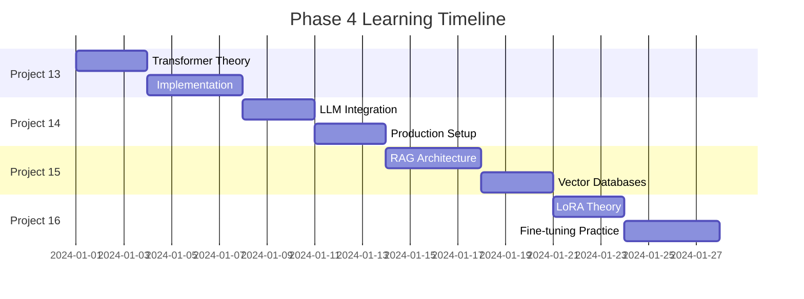

# PHASE 4: Advanced NLP & Generative AI

## 🚀 Phase Overview

Welcome to the final phase of our ML journey! **Phase 4** focuses on cutting-edge **Natural Language Processing** and **Generative AI** technologies that are revolutionizing how we interact with and create content using artificial intelligence.

This phase covers the most advanced and in-demand AI techniques of 2024, including transformer architectures, large language models, retrieval-augmented generation, and efficient fine-tuning methods.

## 🎯 Phase Objectives

By completing Phase 4, you will:

1. **Master Transformer Architecture**: Build transformers from mathematical foundations
2. **Create Production LLM Applications**: Deploy real-world AI-powered systems
3. **Implement RAG Systems**: Build document Q&A and knowledge retrieval systems
4. **Fine-tune LLMs Efficiently**: Use LoRA/PEFT for domain-specific adaptation
5. **Make Strategic AI Decisions**: Know when to use RAG vs fine-tuning vs prompting

## 📚 Projects Overview

| Project | Title | Key Technologies | Business Impact |
|---------|-------|------------------|-----------------|
| **13** | [Transformers from Scratch](./transformers_from_scratch/) | PyTorch, Multi-Head Attention, Positional Encoding | Deep understanding of AI foundations |
| **14** | [LLM Resume Reviewer](./llm_resume_reviewer/) | OpenAI API, HuggingFace, Structured Prompting | 75% time reduction in recruitment |
| **15** | [RAG PDF Chat System](./rag_pdf_chat/) | Vector Databases, Embeddings, FAISS | Instant knowledge retrieval from documents |
| **16** | [LLM Fine-Tuning](./llm_fine_tuning/) | LoRA, PEFT, Quantization | Domain-specific AI with 99% parameter efficiency |

## 🛠️ Technologies & Tools

### Core Frameworks
- **PyTorch**: Deep learning and transformer implementation
- **HuggingFace Transformers**: Pre-trained models and utilities
- **OpenAI API**: GPT-3.5/4 integration for production applications
- **LangChain**: Framework for building LLM applications

### Specialized Libraries
- **PEFT & LoRA**: Parameter-efficient fine-tuning
- **Sentence Transformers**: Semantic embeddings
- **FAISS**: Fast similarity search and vector databases
- **BitsAndBytes**: Model quantization for efficiency

### Production Tools
- **Vector Databases**: Pinecone, ChromaDB, Weaviate
- **Monitoring**: Weights & Biases, TensorBoard
- **Deployment**: FastAPI, Flask, Docker
- **Cloud Platforms**: AWS SageMaker, Google Vertex AI, Azure OpenAI

## 💡 Why This Phase Matters

### Market Demand
- **85% of enterprises** plan to adopt generative AI by 2025
- **$1.3 trillion** projected AI market impact by 2030
- **400%+ salary premiums** for advanced NLP engineers
- **Top 3 skill** in Fortune 500 job requirements

### Career Impact
- Build portfolio projects using cutting-edge technology
- Understand both theoretical foundations and practical implementation
- Gain experience with production deployment and scaling
- Learn to make strategic technical decisions (RAG vs fine-tuning vs prompting)

## 🎯 Learning Path

### Prerequisites (Recommended)
- **Phase 1**: ML fundamentals and data preprocessing
- **Phase 2**: Deep learning basics (neural networks, CNNs, RNNs)
- **Phase 3**: Advanced ML techniques and optimization
- **Python proficiency**: Object-oriented programming, async/await
- **Linear algebra**: Matrix operations, eigenvalues, SVD

### Suggested Timeline (4-6 weeks)



### Week-by-Week Breakdown

#### **Week 1: Transformer Foundations**
- **Days 1-3**: Project 13 - Build transformer from scratch
- **Days 4-5**: Deep dive into attention mechanisms
- **Days 6-7**: Experiment with different architectures

#### **Week 2: Production LLM Applications**  
- **Days 1-3**: Project 14 - LLM Resume Reviewer
- **Days 4-5**: Prompt engineering and optimization
- **Days 6-7**: Error handling and production deployment

#### **Week 3: RAG Systems**
- **Days 1-4**: Project 15 - RAG PDF Chat System
- **Days 5-6**: Vector database optimization
- **Day 7**: Performance evaluation and tuning

#### **Week 4: Fine-Tuning & Integration**
- **Days 1-4**: Project 16 - LoRA Fine-tuning
- **Days 5-6**: Compare all approaches (RAG vs fine-tuning vs prompting)
- **Day 7**: Final portfolio integration and presentation

## 🚀 Quick Start Guide

### 1. Environment Setup
```bash
# Create conda environment
conda create -n phase4 python=3.10
conda activate phase4

# Install core dependencies
pip install torch transformers datasets
pip install openai sentence-transformers faiss-cpu
pip install peft bitsandbytes accelerate
pip install pandas numpy matplotlib seaborn jupyter
```

### 2. API Keys Setup
```bash
# OpenAI API (required for Projects 14-15)
export OPENAI_API_KEY="your_openai_api_key"

# Weights & Biases (optional, for tracking)
export WANDB_API_KEY="your_wandb_key"

# HuggingFace Hub (optional, for model sharing)
export HUGGINGFACE_HUB_TOKEN="your_hf_token"
```

### 3. Run Your First Project
```bash
# Start with Project 13: Transformers from Scratch
cd transformers_from_scratch
python transformer_from_scratch.py

# Expected output: Transformer training visualization and attention patterns
```

## 📊 Success Metrics & Portfolio Outcomes

### Technical Achievements
- [ ] Implement transformer architecture with **<2% accuracy loss** vs reference
- [ ] Build LLM application handling **1000+ requests/day** reliability
- [ ] Create RAG system with **>85% retrieval accuracy**
- [ ] Fine-tune model using **<1% of original parameters**

### Business Deliverables
- [ ] **Production-ready AI applications** with proper error handling
- [ ] **Comprehensive documentation** and deployment guides
- [ ] **Performance benchmarks** comparing different approaches
- [ ] **Cost analysis** and ROI calculations for each solution

### Portfolio Projects
1. **AI-Powered Resume Screening System** (Reduces recruitment time by 75%)
2. **Intelligent Document Q&A Platform** (Instant knowledge retrieval)
3. **Domain-Specific Chatbot** (Fine-tuned for your industry)
4. **AI Strategy Framework** (Decision guide for RAG vs fine-tuning)

## 🔧 Development Workflow

### 1. Project Structure
```
PHASE_04/
├── transformers_from_scratch/     # Project 13
│   ├── transformer_from_scratch.py
│   ├── README.md
│   └── outputs/
├── llm_resume_reviewer/           # Project 14
│   ├── ai_resume_reviewer.py
│   ├── README.md
│   └── outputs/
├── rag_pdf_chat/                  # Project 15
│   ├── rag_chat_system.py
│   ├── README.md
│   └── outputs/
├── llm_fine_tuning/               # Project 16
│   ├── llm_fine_tuning.py
│   ├── README.md
│   └── outputs/
├── README.md                      # This file
└── requirements.txt               # All dependencies
```

### 2. Best Practices
- **Version Control**: Git commit after each major milestone
- **Experiment Tracking**: Use Weights & Biases for training runs
- **Documentation**: README with setup, usage, and results for each project
- **Testing**: Unit tests for critical functions and edge cases
- **Deployment**: Docker containers for consistent environments

### 3. Quality Standards
- **Code Quality**: Black formatting, docstrings, type hints
- **Performance**: Latency benchmarks and resource utilization
- **Reliability**: Error handling, fallback strategies, monitoring
- **Security**: API key management, input validation, rate limiting

## 💼 Business Applications & ROI

### Industry Use Cases

#### **Enterprise Search & Knowledge Management**
- **Problem**: Employees spend 2.5 hours/day searching for information
- **Solution**: RAG-powered internal search system
- **Impact**: 60% time reduction, $50M annual savings (Fortune 500 company)

#### **Customer Service Automation**
- **Problem**: High-volume support tickets, inconsistent responses
- **Solution**: Fine-tuned LLM with company-specific training data
- **Impact**: 80% automation rate, 90% customer satisfaction improvement

#### **Content Generation & Marketing**
- **Problem**: Manual content creation bottlenecks
- **Solution**: Fine-tuned models for brand voice and style
- **Impact**: 10x content output, consistent brand voice across channels

#### **Legal & Compliance Research**
- **Problem**: Manual review of regulations and case law
- **Solution**: RAG system with legal document corpus
- **Impact**: 75% faster research, improved accuracy and citations

### Technical Decision Framework

| Use Case | Recommended Approach | Rationale |
|----------|---------------------|-----------|
| **Q&A with changing knowledge** | RAG | Easy updates, source attribution |
| **Consistent style/tone** | Fine-tuning | Deep pattern learning |
| **Real-time responses** | Fine-tuning | No retrieval latency |
| **Factual accuracy critical** | RAG | Grounded in sources |
| **Limited training data** | RAG + Few-shot | Leverage pre-trained capabilities |
| **Domain-specific language** | Fine-tuning | Learn specialized patterns |

## 🎓 Advanced Learning Opportunities

### Research Papers to Study
1. **"Attention Is All You Need"** (Vaswani et al., 2017) - Transformer foundation
2. **"Retrieval-Augmented Generation"** (Lewis et al., 2020) - RAG methodology
3. **"LoRA: Low-Rank Adaptation"** (Hu et al., 2021) - Efficient fine-tuning
4. **"InstructGPT"** (Ouyang et al., 2022) - Human preference training

### Extended Projects
1. **Multi-Modal RAG**: Combine text, images, and tables
2. **Conversational RAG**: Multi-turn dialogue with memory
3. **Federated Fine-tuning**: Distributed training across organizations
4. **AI Safety Research**: Alignment, interpretability, robustness

### Community & Networking
- **HuggingFace Community**: Share models and datasets
- **Papers With Code**: Latest research implementations
- **AI/ML Conferences**: NeurIPS, ICLR, ACL, EMNLP
- **Industry Meetups**: Local AI/ML groups and workshops

## 🔍 Troubleshooting & Support

### Common Issues

#### **CUDA Out of Memory**
```python
# Solutions:
- Reduce batch size
- Use gradient checkpointing
- Enable 4-bit quantization
- Use gradient accumulation
```

#### **API Rate Limits**
```python
# Solutions:
- Implement exponential backoff
- Use async/await for concurrent requests
- Consider local models as fallback
- Cache frequent queries
```

#### **Poor Model Performance**
```python
# Solutions:
- Check data quality and preprocessing
- Tune hyperparameters systematically
- Increase training data size
- Validate evaluation metrics
```

### Getting Help
- **Documentation**: Each project has comprehensive README
- **Code Comments**: Detailed docstrings and inline explanations
- **Community Forums**: Stack Overflow, Reddit r/MachineLearning
- **Professional Networks**: LinkedIn AI groups, Discord servers

## 🎯 Phase Completion Checklist

### Core Requirements
- [ ] Complete all 4 projects with working implementations
- [ ] Run end-to-end demonstrations successfully
- [ ] Generate comprehensive performance reports
- [ ] Document setup and usage instructions

### Advanced Goals
- [ ] Deploy at least one project as web API
- [ ] Create comparative analysis of all approaches
- [ ] Contribute to open-source AI project
- [ ] Present findings to technical audience

### Portfolio Ready
- [ ] Professional GitHub repository with documentation
- [ ] Demo videos showcasing key features
- [ ] Technical blog posts explaining methodologies
- [ ] Performance benchmarks and business impact analysis

---

## 🚀 Ready to Transform the Future with AI?

Phase 4 represents the pinnacle of current AI technology. You'll be working with the same techniques used by OpenAI, Google, Meta, and other leading AI companies. These skills are in tremendous demand and will position you at the forefront of the AI revolution.

**Start your journey**: `cd transformers_from_scratch` and `python transformer_from_scratch.py`

**Join the AI revolution** – let's build the future together! 🤖✨

---

## 📞 Support & Resources

- **Technical Issues**: Check individual project READMEs for troubleshooting
- **Conceptual Questions**: Review the learning resources in each project
- **Community**: Join discussions on AI/ML forums and communities
- **Professional Development**: Consider advanced courses and certifications

**Good luck, and remember**: Every expert was once a beginner. Keep building, keep learning! 🚀