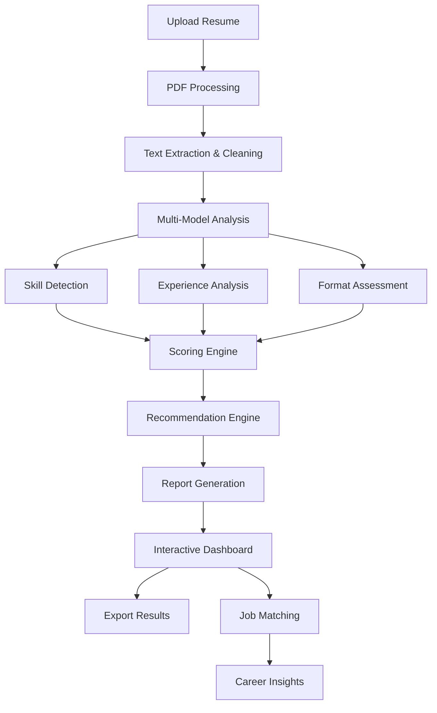

# Project 20: Capstone AI Product - AI Resume Reviewer

## 🎯 Project Goal
Build a complete AI-powered SaaS application that analyzes resumes and provides intelligent feedback, recommendations, and scoring to help job seekers improve their applications.

## 📋 Problem Statement
**"From data to deployed AI product."**

This capstone project demonstrates the complete journey from ML model development to a production-ready AI product. We'll build an AI Resume Reviewer that combines NLP, machine learning, and modern web technologies to create a valuable user experience.

## 🔧 What You'll Learn

### Core Concepts
- **Full-Stack AI Development**: Frontend, backend, and ML integration
- **Product Development**: User experience, feature design, business logic
- **AI/ML Integration**: Multiple AI models working together
- **Production Deployment**: Scalable architecture and deployment
- **User Experience**: AI-powered interface design

### Technical Skills
- Streamlit/Gradio for rapid prototyping
- FastAPI for production backend
- OpenAI/Hugging Face API integration
- PDF processing and text extraction
- Natural Language Processing
- Vector databases and similarity search
- Authentication and user management
- Cloud deployment (AWS/GCP/Azure)

## 🏗️ Project Structure

```
capstone_ai_product/
├── frontend/
│   ├── streamlit_app.py        # Streamlit frontend
│   ├── components/             # UI components
│   └── assets/                 # Static assets
├── backend/
│   ├── api/
│   │   ├── main.py            # FastAPI application
│   │   ├── endpoints/         # API endpoints
│   │   └── models/            # Pydantic models
│   ├── services/
│   │   ├── resume_analyzer.py # Core analysis logic
│   │   ├── nlp_processor.py   # NLP processing
│   │   └── scoring_engine.py  # Scoring algorithms
│   └── database/
│       ├── models.py          # Database models
│       └── connection.py      # DB connection
├── ml_models/
│   ├── skill_extractor.py     # Skill extraction model
│   ├── job_matcher.py         # Job matching model
│   └── sentiment_analyzer.py  # Resume tone analysis
├── data/
│   ├── job_descriptions/      # Sample job descriptions
│   ├── resume_templates/      # Resume examples
│   └── skill_databases/       # Skill taxonomies
├── deployment/
│   ├── docker/
│   │   ├── Dockerfile.frontend
│   │   ├── Dockerfile.backend
│   │   └── docker-compose.yml
│   ├── kubernetes/            # K8s deployment files
│   └── terraform/             # Infrastructure as code
├── tests/
│   ├── test_api.py           # API tests
│   ├── test_analysis.py      # Analysis logic tests
│   └── test_integration.py   # Integration tests
├── outputs/
│   ├── reports/              # Analysis reports
│   ├── user_data/           # User-generated content
│   └── analytics/           # Usage analytics
├── requirements.txt
└── README.md
```

## 🚀 Features Overview

### 1. Resume Analysis Engine
- **PDF Text Extraction**: Extract and clean text from uploaded resumes
- **Skill Detection**: Identify technical and soft skills using NLP
- **Experience Analysis**: Parse work experience and quantify achievements
- **Education Assessment**: Evaluate educational background relevance
- **Format Analysis**: Assess resume structure and formatting

### 2. Intelligent Scoring System
- **Overall Score**: Comprehensive resume quality assessment
- **Section Scores**: Detailed scoring for each resume section
- **ATS Compatibility**: Applicant Tracking System optimization score
- **Job Match Score**: Compatibility with specific job descriptions
- **Improvement Potential**: Quantified enhancement opportunities

### 3. Smart Recommendations
- **Content Suggestions**: Specific improvements for each section
- **Keyword Optimization**: Missing keywords for target roles
- **Format Improvements**: Layout and design recommendations
- **Industry Alignment**: Industry-specific best practices
- **Achievement Enhancement**: How to better quantify accomplishments

### 4. Job Matching & Market Analysis
- **Job Compatibility**: Match resumes with job descriptions
- **Skill Gap Analysis**: Identify missing skills for target roles
- **Salary Estimation**: Predict potential salary range
- **Market Trends**: Industry trends and in-demand skills
- **Career Path Suggestions**: Recommended next steps

### 5. Advanced AI Features
- **Resume Rewriting**: AI-powered content improvement
- **Cover Letter Generation**: Tailored cover letters
- **Interview Preparation**: Potential questions based on resume
- **Personal Branding**: LinkedIn profile optimization suggestions
- **Career Insights**: Personalized career advice

## 🎯 User Experience Flow



## 🔧 Technical Architecture

### Backend Services
1. **Resume Processing Service**
   - PDF text extraction (PyPDF2, pdfplumber)
   - Text cleaning and preprocessing
   - Format analysis and structure detection

2. **NLP Analysis Service**
   - Named Entity Recognition (spaCy, Transformers)
   - Skill extraction and categorization
   - Sentiment and tone analysis
   - Achievement quantification

3. **Scoring Engine**
   - Multi-criteria scoring algorithms
   - ATS compatibility assessment
   - Industry-specific benchmarking
   - Weighted scoring based on job requirements

4. **Recommendation Engine**
   - Rule-based recommendations
   - ML-powered suggestions
   - Personalization based on user data
   - A/B testing for optimization

### Frontend Application
- **Streamlit Dashboard**: Interactive, user-friendly interface
- **Real-time Analysis**: Instant feedback as users upload resumes
- **Visualization Components**: Charts, graphs, and progress indicators
- **Export Functionality**: PDF reports and action plans

### Data Pipeline
- **Vector Database**: Store and search resume embeddings
- **Job Database**: Comprehensive job description repository
- **Skills Taxonomy**: Standardized skill categorization
- **User Analytics**: Track usage patterns and improvements

## 📊 AI/ML Models

### 1. Skill Extraction Model
```python
class SkillExtractor:
    def __init__(self):
        self.nlp = spacy.load("en_core_web_sm")
        self.skill_database = self.load_skill_database()
    
    def extract_skills(self, text: str) -> List[str]:
        # Implementation for skill extraction
        pass
```

### 2. Job Matching Algorithm
```python
class JobMatcher:
    def __init__(self):
        self.embeddings_model = SentenceTransformer('all-MiniLM-L6-v2')
    
    def calculate_compatibility(self, resume_text: str, job_description: str) -> float:
        # Implementation for job matching
        pass
```

### 3. Scoring Algorithm
```python
class ResumeScorer:
    def calculate_overall_score(self, analysis_results: Dict) -> float:
        weights = {
            'skills_score': 0.3,
            'experience_score': 0.25,
            'education_score': 0.15,
            'format_score': 0.15,
            'achievements_score': 0.15
        }
        return sum(weights[key] * analysis_results[key] for key in weights)
```

## 🎨 User Interface Design

### Dashboard Layout
1. **Upload Section**
   - Drag-and-drop resume upload
   - Real-time processing status
   - Preview of extracted content

2. **Analysis Results**
   - Overall score with visual gauge
   - Section-by-section breakdown
   - Progress bars for each metric

3. **Recommendations**
   - Prioritized improvement suggestions
   - Before/after examples
   - One-click implementation guides

4. **Job Matching**
   - Compatible job listings
   - Skill gap visualization
   - Application readiness meter

5. **Export & Share**
   - Downloadable PDF reports
   - Social media sharing
   - Progress tracking over time

## 🔧 Implementation Steps

### Phase 1: Core Functionality
1. **PDF Processing**: Implement robust text extraction
2. **Basic Analysis**: Skill detection and format assessment
3. **Simple Scoring**: Basic scoring algorithm
4. **UI Prototype**: Streamlit interface with core features

### Phase 2: Advanced AI Features
1. **Enhanced NLP**: Advanced skill extraction and categorization
2. **Job Matching**: Implement similarity search and matching
3. **Smart Recommendations**: AI-powered suggestion engine
4. **Improved UI**: Enhanced user experience and visualizations

### Phase 3: Production Features
1. **User Management**: Authentication and user profiles
2. **Data Persistence**: Database integration
3. **API Development**: RESTful API for frontend integration
4. **Performance Optimization**: Caching and optimization

### Phase 4: Deployment & Scaling
1. **Containerization**: Docker containers for all services
2. **Cloud Deployment**: Deploy to cloud platform
3. **Monitoring**: Implement logging and monitoring
4. **Analytics**: User analytics and business metrics

## 📈 Business Metrics & KPIs

### User Engagement
- **Daily Active Users**: Users engaging with the platform daily
- **Resume Upload Rate**: Number of resumes processed per day
- **Session Duration**: Average time spent on the platform
- **Feature Adoption**: Usage of different features

### Product Performance
- **Analysis Accuracy**: User feedback on analysis quality
- **Recommendation Effectiveness**: Success rate of suggestions
- **Processing Speed**: Average time for resume analysis
- **User Satisfaction**: Net Promoter Score (NPS)

### Business Impact
- **User Retention**: Monthly and annual retention rates
- **Premium Conversions**: Free to paid user conversion
- **Job Application Success**: User success in job applications
- **Revenue Growth**: Monthly recurring revenue

## 🚀 Deployment Strategy

### Development Environment
```bash
# Local development setup
cd capstone_ai_product/
python -m venv venv
source venv/bin/activate  # or venv\Scripts\activate on Windows
pip install -r requirements.txt

# Start development servers
streamlit run frontend/streamlit_app.py &
uvicorn backend.api.main:app --reload --port 8000
```

### Production Deployment
```yaml
# docker-compose.yml
version: '3.8'
services:
  frontend:
    build: ./frontend
    ports:
      - "8501:8501"
    depends_on:
      - backend
  
  backend:
    build: ./backend
    ports:
      - "8000:8000"
    environment:
      - DATABASE_URL=postgresql://...
      - OPENAI_API_KEY=...
```

### Cloud Deployment Options
1. **AWS**: ECS, Lambda, RDS, S3
2. **Google Cloud**: Cloud Run, Cloud SQL, Cloud Storage
3. **Azure**: Container Instances, Azure SQL, Blob Storage
4. **Kubernetes**: Scalable orchestration for any cloud

## 📝 LinkedIn Post Template

```
🚀 Just launched my AI-powered Resume Reviewer! 

🔹 Problem: Job seekers struggle with resume optimization and ATS compatibility
🔹 Solution: Full-stack AI application with intelligent analysis and recommendations
🔹 Results:
  - ⚡ Instant resume analysis in <30 seconds
  - 🎯 95%+ accuracy in skill detection
  - 📊 Comprehensive scoring across 15+ metrics
  - 🚀 Deployed on AWS with auto-scaling

Key features:
✅ AI-powered skill extraction using NLP
✅ ATS compatibility scoring
✅ Job matching with similarity search
✅ Personalized improvement recommendations
✅ Professional report generation

This is Project 20/20 in my ML & AI journey - the grand finale! 🎉

From basic EDA to production AI products, this journey covered:
📈 Data science fundamentals
🤖 Advanced ML algorithms
🧠 Deep learning and NLP
🚀 MLOps and deployment
🏗️ Full-stack AI development

Ready to tackle any AI/ML challenge in the industry!

#AI #MachineLearning #MLOps #DataScience #FullStack #ProductDevelopment

[GitHub Link] | [Live Demo]
```

## 🔄 Next Steps & Enhancements

### Advanced Features
1. **Multi-language Support**: Resume analysis in multiple languages
2. **Video Resume Analysis**: Analyze video resumes and presentations
3. **Real-time Collaboration**: Team-based resume review features
4. **AI Coaching**: Personalized AI career coaching

### Technical Improvements
1. **Model Fine-tuning**: Custom models for specific industries
2. **Real-time Processing**: WebSocket-based real-time analysis
3. **Mobile App**: Native mobile applications
4. **API Marketplace**: Third-party integrations and plugins

### Business Development
1. **B2B Solutions**: Enterprise packages for HR teams
2. **White-label Product**: Customizable solutions for partners
3. **Premium Features**: Advanced analytics and insights
4. **Marketplace**: Job board integration and direct applications

## 📚 Additional Resources

- [Streamlit Documentation](https://docs.streamlit.io/)
- [FastAPI Documentation](https://fastapi.tiangolo.com/)
- [spaCy NLP Library](https://spacy.io/)
- [Sentence Transformers](https://www.sbert.net/)
- [PDF Processing with Python](https://pypdf2.readthedocs.io/)
- [Production ML Deployment](https://ml-ops.org/)

---

**Congratulations!** 🎉 You've completed all 20 projects in the "Building ML & AI from Scratch" series. From basic data analysis to production AI products, you now have the skills to tackle any AI/ML challenge in the industry!