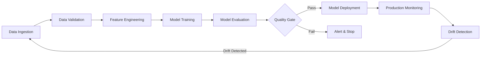

# Project 18: End-to-End ML Pipeline

## 🎯 Project Goal
Build a complete, automated ML pipeline that handles data ingestion, preprocessing, model training, evaluation, and deployment with proper orchestration and monitoring.

## 📋 Problem Statement
**"Production ML is 80% engineering."**

Most ML projects fail because they lack robust engineering practices. This project demonstrates how to build production-ready ML pipelines that can run reliably, scale effectively, and maintain themselves.

## 🔧 What You'll Learn

### Core Concepts
- **Pipeline Orchestration**: Airflow/Prefect for workflow management
- **Data Ingestion**: Automated data collection and validation
- **Feature Engineering**: Automated feature creation and selection
- **Model Training**: Automated training with hyperparameter optimization
- **Model Validation**: Comprehensive model evaluation and testing
- **Deployment Automation**: Seamless model deployment and versioning

### Technical Skills
- Workflow orchestration with Apache Airflow
- Data validation and quality checks
- MLflow for experiment tracking and model registry
- Docker for containerized pipeline components
- CI/CD for ML pipelines
- Pipeline monitoring and alerting

## 🏗️ Project Structure

```
ml_pipelines/
├── dags/
│   └── ml_pipeline_dag.py      # Airflow DAG definition
├── pipeline/
│   ├── data_ingestion.py       # Data collection module
│   ├── data_validation.py      # Data quality checks
│   ├── feature_engineering.py  # Feature creation
│   ├── model_training.py       # Training module
│   ├── model_evaluation.py     # Evaluation module
│   └── model_deployment.py     # Deployment module
├── config/
│   ├── pipeline_config.yaml    # Pipeline configuration
│   └── data_schema.yaml        # Data validation schema
├── tests/
│   ├── test_pipeline.py        # Pipeline tests
│   └── test_components.py      # Component tests
├── docker/
│   ├── Dockerfile.pipeline     # Pipeline container
│   └── docker-compose.yml      # Multi-service setup
├── outputs/
│   ├── models/                 # Trained models
│   ├── data/                   # Processed data
│   ├── reports/                # Evaluation reports
│   └── logs/                   # Pipeline logs
├── requirements.txt            # Dependencies
└── README.md                   # This file
```

## 🚀 Getting Started

### Prerequisites
- Python 3.9+
- Docker and Docker Compose
- Apache Airflow (or Prefect)
- MLflow server

### Quick Setup
1. **Environment Setup**
   ```bash
   cd ml_pipelines/
   pip install -r requirements.txt
   ```

2. **Start Services**
   ```bash
   docker-compose up -d
   ```

3. **Initialize Airflow**
   ```bash
   airflow db init
   airflow users create --username admin --password admin --firstname Admin --lastname Admin --role Admin --email admin@example.com
   ```

4. **Start Pipeline**
   ```bash
   airflow webserver --port 8080 &
   airflow scheduler &
   ```

## 📊 Pipeline Components

### 1. Data Ingestion
- **Sources**: APIs, databases, file systems, streaming data
- **Validation**: Schema validation, data quality checks
- **Storage**: Raw data lake, processed data warehouse
- **Monitoring**: Data freshness, completeness, anomalies

### 2. Feature Engineering
- **Transformations**: Scaling, encoding, feature creation
- **Selection**: Automated feature selection
- **Validation**: Feature drift detection
- **Caching**: Feature store integration

### 3. Model Training
- **Algorithms**: Multiple model types with hyperparameter tuning
- **Cross-validation**: Robust model validation
- **Experiment tracking**: MLflow integration
- **Resource management**: Distributed training support

### 4. Model Evaluation
- **Metrics**: Comprehensive evaluation metrics
- **Validation**: Business metrics validation
- **Comparison**: Model performance comparison
- **Approval**: Automated/manual approval gates

### 5. Model Deployment
- **Staging**: Deploy to staging environment
- **Testing**: A/B testing capabilities
- **Production**: Blue-green deployment
- **Rollback**: Automated rollback on failures

## 🔄 Pipeline Workflow



## ⚙️ Configuration

### Pipeline Configuration (pipeline_config.yaml)
```yaml
data_ingestion:
  source_type: "api"
  source_url: "https://api.example.com/data"
  batch_size: 1000
  schedule: "0 */6 * * *"  # Every 6 hours

feature_engineering:
  scaling_method: "standard"
  feature_selection: "rfe"
  max_features: 50

model_training:
  algorithms: ["random_forest", "xgboost", "lightgbm"]
  cv_folds: 5
  hyperparameter_tuning: true
  max_trials: 100

deployment:
  environment: "staging"
  approval_required: true
  rollback_enabled: true
```

## 📈 Monitoring & Alerting

### Key Metrics
- **Data Quality**: Completeness, accuracy, consistency
- **Pipeline Performance**: Runtime, success rate, throughput
- **Model Performance**: Accuracy, latency, drift
- **Resource Usage**: CPU, memory, disk, network

### Alert Conditions
- Pipeline failures or timeouts
- Data quality issues
- Model performance degradation
- Resource threshold breaches
- Drift detection

## 🧪 Testing Strategy

### Unit Tests
- Individual component testing
- Data validation functions
- Feature engineering logic
- Model training modules

### Integration Tests
- End-to-end pipeline testing
- Data flow validation
- Service integration testing
- Error handling verification

### Performance Tests
- Pipeline runtime benchmarks
- Scalability testing
- Resource usage profiling
- Bottleneck identification

## 📊 Outputs & Reports

The pipeline generates comprehensive outputs:

1. **Model Artifacts**
   - Trained models (multiple formats)
   - Feature transformers
   - Model metadata and lineage

2. **Evaluation Reports**
   - Performance metrics
   - Feature importance
   - Model interpretability reports
   - Business impact analysis

3. **Data Quality Reports**
   - Data profiling results
   - Anomaly detection reports
   - Drift analysis
   - Data lineage tracking

4. **Pipeline Monitoring**
   - Execution logs
   - Performance metrics
   - Resource utilization
   - Alert summaries

## 🚀 Advanced Features

### Model Versioning
- Automated model versioning with MLflow
- Model registry for production models
- A/B testing infrastructure
- Gradual rollout capabilities

### Data Versioning
- DVC for data version control
- Data lineage tracking
- Reproducible data pipelines
- Automated data backup

### Feature Store
- Centralized feature repository
- Feature sharing across teams
- Feature lineage and governance
- Real-time and batch features

## 📝 LinkedIn Post Template

```
🏭 Just built my first production ML pipeline!

🔹 Problem: ML models are useless without proper engineering
🔹 Solution: End-to-end automated pipeline with Airflow + MLflow
🔹 Results:
  - ⚡ Fully automated data → model → production
  - 🔄 95% reduction in manual work
  - 📊 Comprehensive monitoring & alerting
  - 🚀 Deploy new models in minutes

Key learnings:
✅ Pipeline orchestration is critical for ML success
✅ Data quality checks prevent garbage models
✅ Automated testing catches issues early
✅ Monitoring enables proactive maintenance

This is Project 18/20 in my ML & AI journey. Follow to see the full series!

#MLOps #MachineLearning #DataEngineering #Airflow #MLflow #Production

[GitHub Link]
```

## 🔄 Next Steps

1. **Advanced Orchestration**
   - Implement complex dependencies
   - Add dynamic pipeline generation
   - Integrate with Kubernetes

2. **Enhanced Monitoring**
   - Real-time dashboards
   - Predictive alerting
   - SLA monitoring

3. **MLOps Integration**
   - GitOps for ML
   - Infrastructure as Code
   - Multi-cloud deployment

4. **Governance & Compliance**
   - Model explainability
   - Audit trails
   - Compliance reporting

## 📚 Additional Resources

- [Apache Airflow Documentation](https://airflow.apache.org/docs/)
- [MLflow Documentation](https://mlflow.org/docs/latest/index.html)
- [ML Pipeline Design Patterns](https://ml-ops.org/content/ml-pipelines)
- [Production ML Systems](https://developers.google.com/machine-learning/guides/rules-of-ml)